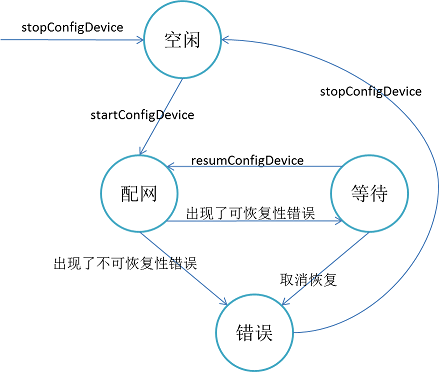

 
Copyright 2017 
Midea Smart Technology Co.,Ltd.  

----

# API文档
- [家庭组API文档](./doc/javadoc_family/index.html);  
- [单用户API文档](./doc/javadoc_user/index.html);  

# SDK下载
- [家庭组SDK](./lib/MideaSDK-3.1.3(IPF-R66EC).zip);
- [单用户SDK](./lib/MideaSDK-3.1.3(IPU-R66EC).zip);

# MideaSDK 3.0 集成说明

# 概述
Midea SDK是美的智慧家居系统控制端接入的一套Android系统开发工具包，第三方开发者可以使用这套工具包提供的接口接入到美的智慧家居系统中实现本地或者远程控制美的家电。  
SDK适用的场景包括：手机、机电盒、智能电视、智能硬件设备等。

# 功能
SDK主要提供的功能包括：   
1.  账号注册登陆。     
2.  设备配网和云端绑定。
3.  局域网设备扫描。
4.  设备控制命令本地/远程下发。    
5.  服务器业务请求封装。    
6.  设备协议可视化解析。    
	   
# 业务介绍  
SDK分为家庭业务模型和单用户业务模型。    
 1.单用户模型：家电设备直接与用户进行绑定，单个设备在用户之间进行分享。  
 2.家庭模型：家电和家庭进行关联，无法实现单个设备分享，用户通过加入家庭进行家庭中所有设备的全部共享。
 > 推荐使用单用户模型，因为数据模型耦合度低，扩展性好。但是如果需要和美居进行数据互通，则需要使用家庭租模型。

# 代码目录介绍
- DemoFamily: 家庭组业务模型Demo。  
- DemoNormal: 单用户业务模型Demo。  
- MSmartSDK: SDK源代码。  

# SDK使用前准备
1. 注册美的智慧家居开发者账号。
2. 可上网2.4G路由器一台。
3. 美的智能家电一台。
4. MideaSDK开发包。
5. 申请AppID,AppKey,AppSrc三个参数。
6. SDK提供的API文档。
7. 智能手机一台（Android 4.0及以上）。  

> 目前美的智能家电仅支持2.4G网络。一般家电上有MSmart标识的家电为智能家电，如果不确定可以咨询售后进行确认。智能手机也可以是任何可连接网络的Android平台硬件终端。  

 **登陆美的智慧家居开发者官网申请AppID,AppKey,AppSrc：**[开发者官网](https://iot.midea.com/develop)

# 开发流程

1. 注册开发者。
2. 体检开发申请。   
3. 获取AppID等参数。
4. 下载SDK。
5. 集成配网SDK。  
6. 开发审核发布。

# SDK配置
> 从官网下载的SDK包里面包含了**jar**, **javadoc**,**jni**三个目录，分别代表jar文件，API文件，SO库文件。

配置步骤如下：
1. 将jar文件拷贝到工程的libs文件夹。
2. 将so库文件拷贝到工程响应的jni库目录。
3. 在应用程序启动的时候初始化MSmartSDK。
> 不同的项目，可能libs文件夹，so库文件都可能不一样，请根据实际情况进行操作。

Android权限配置如下：
```
<uses-permission android:name="android.permission.WRITE_EXTERNAL_STORAGE"/>  
<uses-permission android:name="android.permission.WAKE_LOCK" />
<uses-permission android:name="android.permission.READ_EXTERNAL_STORAGE" />
<uses-permission android:name="android.permission.FLASHLIGHT" />
<uses-permission android:name="android.permission.CHANGE_WIFI_STATE" />
<uses-permission android:name="android.permission.INTERNET" />
<uses-permission android:name="android.permission.ACCESS_NETWORK_STATE" />
<uses-permission android:name="android.permission.ACCESS_WIFI_STATE" />
<uses-permission android:name="android.permission.WRITE_EXTERNAL_STORAGE" />
<uses-permission android:name="android.permission.ACCESS_FINE_LOCATION" />
<uses-permission android:name="android.permission.ACCESS_COARSE_LOCATION" />
<uses-permission android:name="android.permission.WRITE_EXTERNAL_STORAGE"/>
<uses-permission android:name="android.permission.ACCESS_LOCATION_EXTRA_COMMANDS" />
```
> **注意**：
>- 目前市场上主要的Android系统为5.0,6.0。因为6.0增加了用户动态权限，SDK需要动态申请的权限包括Manifest.permission.ACCESS_FINE_LOCATION和Manifest.permission.ACCESS_COARSE_LOCATION这两个权限。建议在APP启动的时候就检查这两个权限是否开通。
>- 在新的手机上基本都关闭了APP的默认权限，请检查: *设置*---*应用*---*您的APP*---*权限*， 请打开APP所有的权限设置。
>- 因为Android 6.0及以上系统的限制，网络操作一般需要打开GPS开关，请在系统设置界面位置信息里面开启位置信息。


# 功能业务介绍
> 按照SDK所提供的功能分类进行介绍SDK如何进行快速接入使用。  

### 业务流程
1. SDK初始化。
2. 注册账号。
3. 登陆账号。
4. 设备配网。
5. 设备控制。

### 主要业务介绍
1. 接口调用规则。
2. 注册/登陆业务。
3. 配网业务。
4. 局域网扫描业务。
5. 设备控制业务。

### 接口调用原则
SDK的大部分接口都是异步接口，意味着大部分接口都必须传入一个callback。Midea SDK的callback采用了泛型机制，回调的数据存放在bundle中，以此来提高SDK未来的扩展性。回调分为三种类型：
- 无数据回调，仅仅提示成功和错误的回调:MSmartCallback。
- 携带数据回调,成功的时候携带回请求的数据:MSmartDataCallback<T>。
- 携带流程步骤的回调，继承了MSmartDataCallback，同时在流程进行过程中反馈流程步骤：MSmartStepDataCallback.
> 在SDK中大部分携带数据的回调泛型为：MSmartDataCallback<Bundle>类型。MSmartStepDataCallback主要用在配网流程返回配网的每一个步骤。

SDK所有的接口都是线程安全的（注意：都派发到了主线程中），并且回调无论成功/错误/步骤回调都运行在主线程。  
例如：
```
MSmartUserManager mUserManager = (MSmartFamilyDeviceManager) MSmartSDK.getInstance().getSDKManager(MSmartSDK.DEVICE_MANAGER_NAME);  
mUserManager.loginWithAccount(userAccount, password, extraData, new MSmartCallback() {
                    @Override
                    public void onComplete() {
                        //在主线程
                    }

                    @Override
                    public void onError(MSmartErrorMessage errMsg) {
                        //在主线程
                    }
                }
        );
```

### SDK初始化
SDK需要使用从开放官网申请的AppKey，AppID,AppSrc三个参数初始化SDK。

```
MSmartSDK.getInstance().initSDKWithAppID(Context, appID, appKey, appSrc);
```

> 未初始化的SDK无法调用，一般推荐的应用的自定义Application的onCreate()里面进行初始化，重复初始化无影响，SDK会以第一次初始化参数为准。

### 业务接口获取
Midea包含三大业务：
1. 用户管理业务:提供用户注册，登陆，修改信息等功能。接口：MSmartUserManger。
2. 家庭管理管理业务：仅限家庭租业务模型SDK存在，提供家庭的增删改查等功能。接口：MSmartUserManager。
3. 设备管理业务：提供设备配网，查找，修改，控制等功能。设备管理在家庭组和单用户两套业务模型下对应的接口不同。  
    1. 家庭设备管理：仅限在家庭组业务模型下存在，接口：MSmartFamilyDeviceManager。  
    2. 用户设备管理：仅限在单用户业务模型下存在，接口：MSmartUserDeviceManager。

这些业务管理类的获取方式都是通过MSmartSDK这个对外单例类提供：

```
//获取用户管理接口
MSmartUserManager mUserManager = (MSmartUserManager) MSmartSDK.getInstance().getSDKManager(MSmartSDK.USER_MANAGER_NAME);

//获取家庭管理接口,单用户模型下获取无效
MSmartFamilyManager mFamilyManager = (MSmartFamilyManager)MSmartSDK.getInstance().getSDKManager(MSmartSDK.FAMILY_MANAGER_NAME);

//获取家庭设备管理接口，单用户模型下获取无效
MSmartFamilyDeviceManager mDeviceManager = (MSmartFamilyDeviceManager)MSmartSDK.getInstance().getSDKManager(MSmartSDK.DEVICE_MANAGER_NAME);

//获取用户设备管理接口，家庭组模型下获取无效
mDeviceManager = (MSmartUserDeviceManager) MSmartSDK.getInstance().getSDKManager(MSmartSDK.DEVICE_MANAGER_NAME);
```
> 注意：家庭组模型下是不存在MSmartUserDeviceManager这个类的，单用户下是不存在MSmartFamilyManager,MSmartFamilyDeviceManager.


### 注册/登陆业务
SDK支持如下几种账号的注册/登陆：
1. 手机号注册/登陆：使用手机注册和登陆，注册前需要获取手机短信验证码。
2. 邮箱注册/登陆：使用邮箱地址注册和登陆，会收到激活邮件。未激活的账号将无法进行修改操作。
3. 美家账号注册/登陆：仅限美的内部事业部美家账号。
4. QQ登陆：使用QQ的授权机制进行第三方登陆，无需注册。
5. 微信登陆：使用微信的授权机制进行第三方登陆，无需注册。
> Midea SDK要求登陆之后才能使用。

### 配网业务
Midea SDK的配网业务是SDK的核心业务之一，其功能是将美的家电配置连接到家庭路由器上，从而实现家电联网和连接美的智慧云。   
Midea SDK支持的配网方式：
1. AP配网。
2. 快连配网。

Midea SDK配网的主要流程： 
1. 扫描家电二维码。
2. 配网。
3. 激活/绑定。 

Midea SDK配网相关接口：
>因为配网操作是设备管理，所以方法来自配网管理接口：*MSmartFamilyDeviceManager*或*MSmartUserDeviceManager*

方法名称 | 方法说明
---|---
startConfigureDevice | 启动配网
resumeConfigureDevice | 恢复配网
stopConfigureDevice | 停止配网


Midea SDK配网状态转移图：
  

恢复配网说明：  
状态转移图中可恢复型错误目前主要有：   
1. 启用WIFI失败。
2. 连接路由器失败。
3. 连接设备热点失败。
4. 重新连接路由器失败。    

在配网过程中，不管是哪一种失败，都会触发错误回调。但是在以上几种可恢复性错误回调中，会返回携带数据，如果携带的数据中包含boolean类型的数据：*manualOperation*,且该参数的值为true，流程才会进入等等状态，等待用户完成指定操作以后，调用resumeConfigureDevice继续之前的配网流程。   
配网过程是一个闭包的过程,resumeCofigureDevice恢复配网以后，配网的进度和结果还是通过startConfigureDevice传入的callback进行回调通知。
> 建议：在新配网或者添加局域网设备(***addDevice***)之前，可以调用一下stopConfigureDevice避免意外干扰。  

### 局域网扫描业务
局域网扫描功能能够在扫描到当前路由器下所有已经连接路由的家电设备。
Midea SDK配网相关接口：

方法名称 | 方法说明
---|---
startScanLanDevice | 启动设备扫描任务
registerDeviceScanListener | 注册局域网设备监听器
removeDeviceScanListener | 移除局域网设备监听器

startScanLanDevice 和 registerDeviceScanListener都能够回调局域网中的设备，但是二者的区别在于：  
1. startScanLanDevice: 是一个任务化的接口，扫描指定时间范围内的所有设备信息，会立即启动一个扫描周期。
2. registerDeviceScanListener: 是一个即时接口，不会立即启动扫描，但收到设备立即返回，每次返回一个设备，可以长期监听局域网设备情况。

```
void startScanLanDevice(int time,MSmartDataCallback<List<android.os.Bundle>> callback)
```
所以如果希望快速扫描到局域网的某个设备，可以按照如下方式进行调用：

```
//会立即启动一个扫描周期
mDeviceManager.startScanLanDevice(0,null);
mDeviceManager.registerDeviceScanListener(listener);
```

### 设备控制业务
设备控制涉及的接口：

接口名称 | 接口说明
---|---
sendDeviceData | 直接发送设备二进制控制命令
queryDeviceState | 查询设备的Profile状态
getDeviceState | 直接返回缓存的设备Profile状态
updateDeviceState | 使用设备Profile控制设备


设备控制分为两种不同的方式：
1. 直接发送设备二进制控制命令。
2. 发送设备属性Profie进行控制。

**直接发送设备二进制控制命令**：  由上层封装好设备的控制命令，SDK收到命令后直接发送给设备，然后等待设备响应并回调设备响应的数据。    

接口定义：  
```
public void sendDeviceData(String deviceID, byte[] data,MSmartDataCallback<byte[]> callback);
```
> 注意：设备控制响应超时时间为10s

**发送设备属性Profie进行控制**：将设备的功能进行阅读性更好的Profie定义，例如：*{"power":"on"}*。这样每次控制只需要传入这样的json字符串或者Key-Value定义，就可以实现对设备的控制，无需关注设备电控协议，以一种更加可读的方式进行设备控制。
控制接口定义：
```
void updateDeviceState(String deviceID,Map<String,String> stateMap,MSmartDataCallback<MSmartDeviceState> callback)
```


> 说明：每一个美的家电都有一份Profie定义文档，请在开放官网进行下载查看。

# SDK事件
SDK的事件通过事件码进行区分，事件码定义在MSmartEventCode这个接口中。
相关的接口：

接口名称 | 方法名称| 说明
---|---|---
MSmartSDK | registerSDKEventListener | 注册事件监听
MSmartSDK | removeSDKEventListener | 取消事件监听

> 注意：不同的事件所携带返回的数据不同，请仔细阅读MSmartEventCode这个类关于各个事件码的定义及返回数据。

# SDK推送
SDK的事件上报比较依赖推送，因此需要配置推送。SDK使用了极光推送组件，相关的推送KEY需要联系技术支持人员进行分配，后续会在开发者官网进行自动化申请。推送需要APP进行配置，并没有集成在SDK中，APP在收到推送之后需要将推送消息派发给SDK进行处理，SDK处理完毕后会以不同的事件回调的方式通知到APP。  
相关的接口：

接口名称 | 方法名称| 说明
---|---|---
MSmartSDK | handlePushMessage | 处理推送消息

> 注意：极光推送的配置，直接参照官网进行配置即可，但是JPUSH_APPKEY是需要联系我们技术人员进行分配的，极光官网申请的无效。


# 其它接口说明
1. 开启SDK日志:

接口名称 | 方法名称 | 接口说明
---|---|---
MSmartSDK | enableLog | 开启SDK日志显示，正式发布时需要关闭日志

2. 数据同步：

接口名称 | 方法名称 | 接口说明
---|---|---
MSmartUserDeviceManager/MSmartFamilyDeviceManager  | syncCloudData | 与云端进行数据同步

> 说明：登陆的时候会对云端数据进行本地缓存，以加快业务接口速度，如果涉及到一个账号多端登陆，为避免拉取设备列表/家庭列表与服务器出现不一致，可以调用syncCloudData进行数据同步。

# 技术支持
- 王攀(pan.wang@midea.com)
